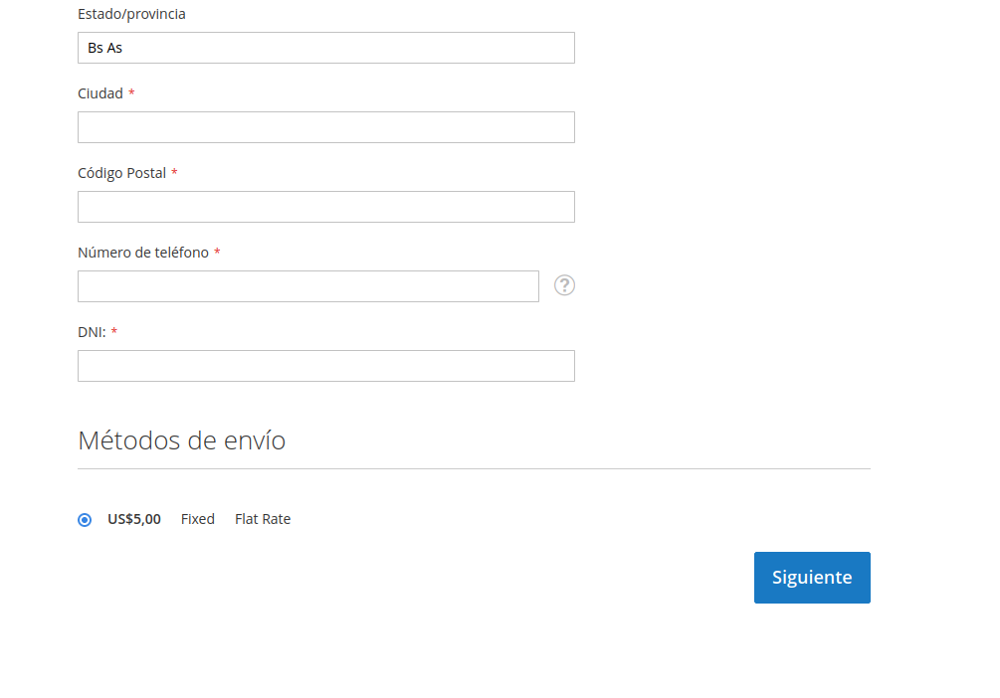
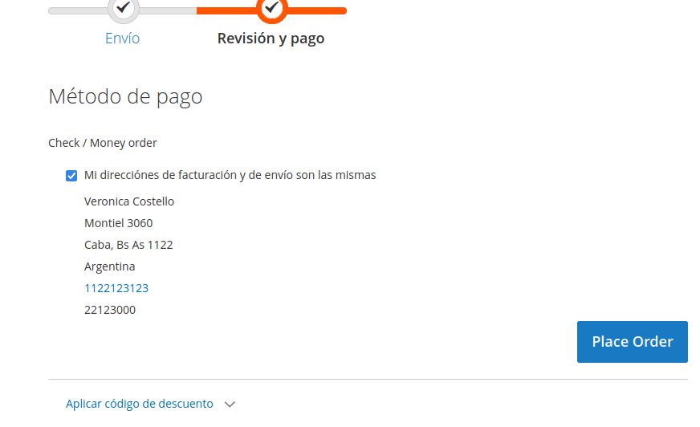
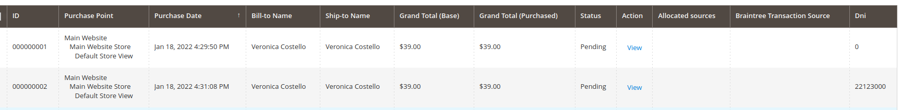
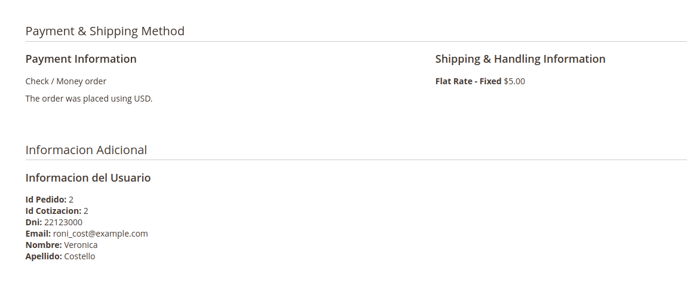
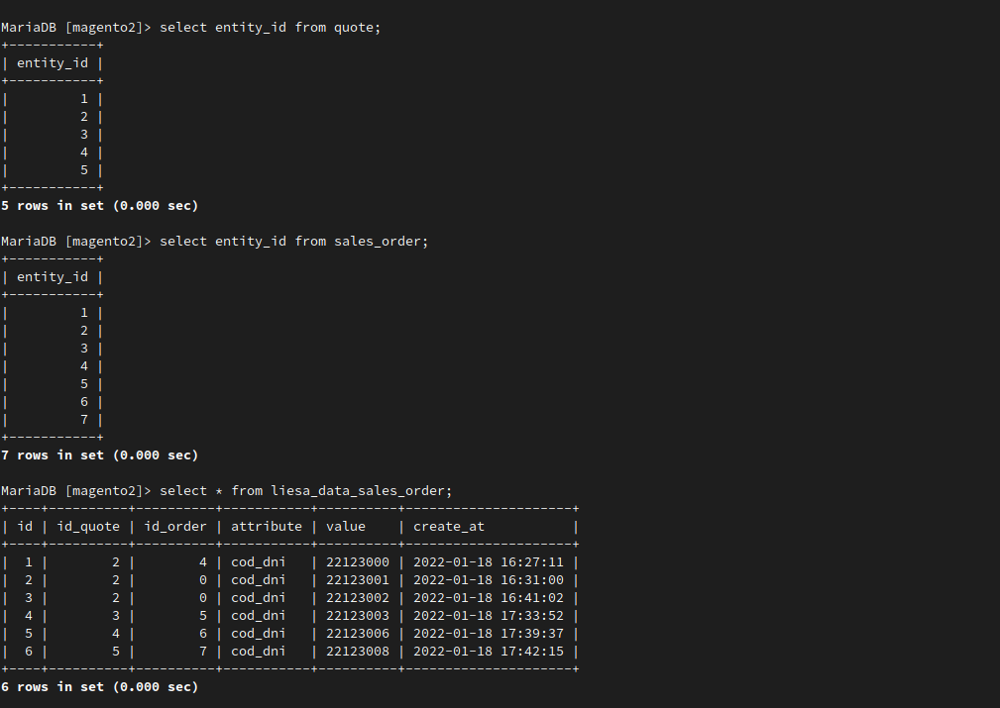
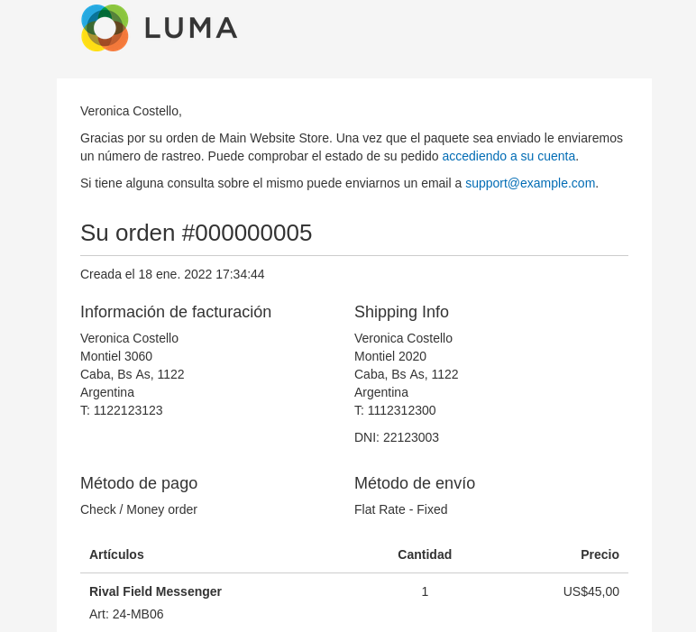
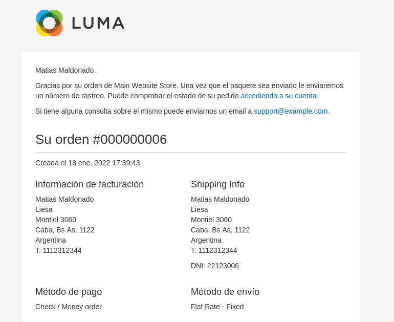

# Mage2 Module Liesa AddDataSalesOrder

    ``liesa/module-AddDataSalesOrder``

 - [Main Functionalities](#funcionalidades_modulo)
 - [Installation](#instalacion_modulo)
 - [Arbol de modulo](#arbol_modulo)
 - [Estrutctura de programacion ](#estructura_modulo)

## Main Functionalities
Nuevo campo en el checkout de compra para agregar un dato de DNI en la orden de compra

## Installation
\* = in production please use the `--keep-generated` option

### Type 1: Zip file

 - Unzip the zip file in `app/code/Liesa`
 - Enable the module by running `php bin/magento module:enable Liesa_AddDataSalesOrder`
 - Apply database updates by running `php bin/magento setup:upgrade`\*
 - Flush the cache by running `php bin/magento cache:flush`

### Type 2: Composer

 - Make the module available in a composer repository for example:
    - private repository `repo.magento.com`
    - public repository `packagist.org`
    - public github repository as vcs
 - Add the composer repository to the configuration by running `composer config repositories.repo.magento.com composer https://repo.magento.com/`
 - Install the module composer by running `composer require liesa/module-Testing`
 - enable the module by running `php bin/magento module:enable Liesa_AddDataSalesOrder`
 - apply database updates by running `php bin/magento setup:upgrade`\*
 - Flush the cache by running `php bin/magento cache:flush`

## Arbol del modulo

 - Block
	- Adminthml/Order/View
      - **Cod.php**
 - etc
   - frontend
      - routes.xml
   - di.xml
   - events.xml
   - extension_attributes.xml
   - modules.xml
 - Model
   - ResourceModel
      - EavOrder
         - **Collection.php**
      - **EavOrder.php**
   - **EavOrder.php**
 - Observer
   - **ObserverforAddCustomVariable.php**
   - **SaveToOrder.php**
 - Plugin
	- Checkout 
      - Model
         - **ShippingInformationMan.php**
      - **LayoutProcessor.php**
   - Order
      - **PlaceAfterPlugin.php**
 - Setup
   - **InstallSchema.php**
   - **Unistall.php**
 - Ui
   - Component
      - Listening
         - Column
            - **CodDni.php**
 - view 
   - adminhtml
      - layout
         - **sales_order_view.xml**
      - templates
         - order
            - view
               - **custom.phtml**
      - ui_component
         - **sales_order_grid.xml**
   - frontend
      - imag
      - web
         - model
            - shipping-save-processor
               - **default.js**
      - **requirejs-config.js**

## Estructura del Modulo

### Frontend
 1- Para usar el campo nuevo deberia finalizar la compra en el carrito
 http://magento2.docker/checkout/#shipping

 
 2- Terminar la compra en la revision de pago y listo

### Backend
1- Columna nueva en la order de compra

2-Informacion adicional en la vista de la orden

### Base de datos
 La base de datos esta compuesto por 6 columnas, 2 de ellas son los id de sales_order y otra es de quote, ademas contiene attribute y value

### Email
Este es el template de email para clientes con el dato de dni

Este es el template de email para invitados con el dato de dni

